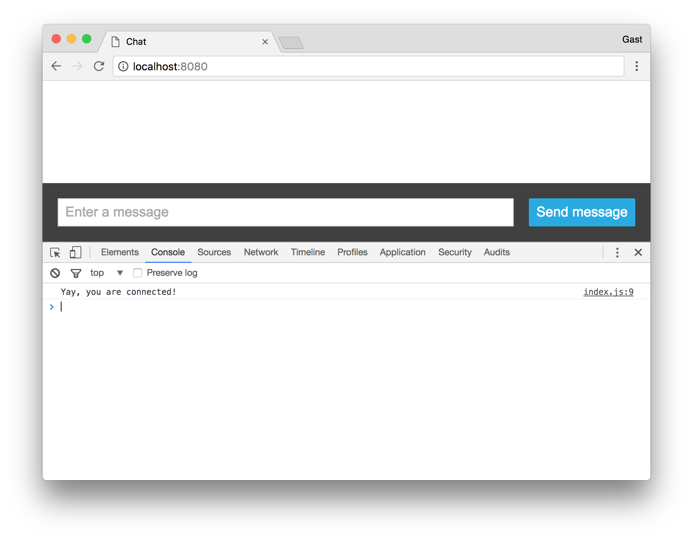
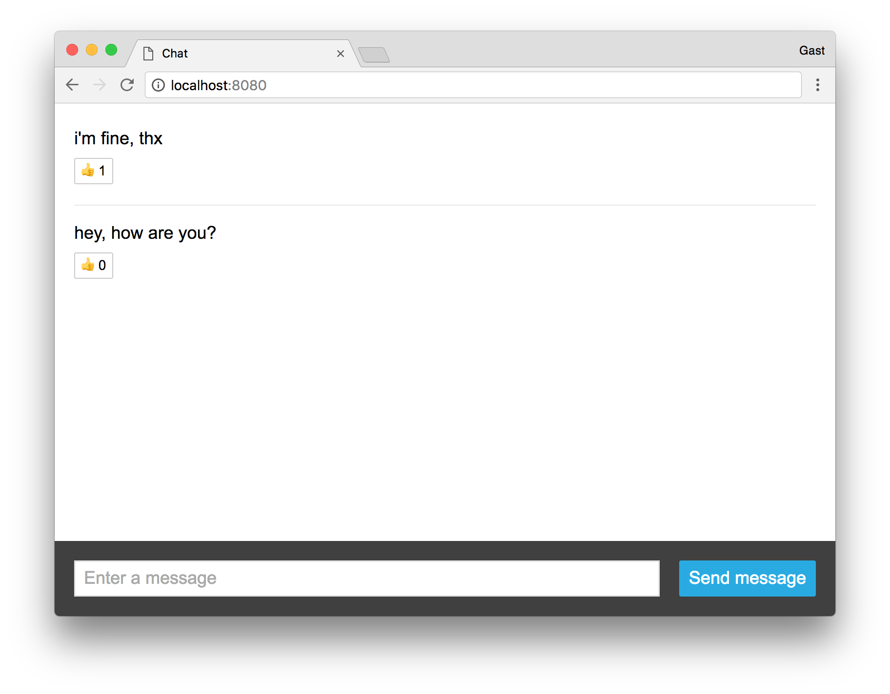

# Creating the client

As wolkenkit is a backend framework, you are completely free to create whatever client you want to, as long as it is able to do HTTP requests.

For JavaScript, there is a client SDK that internally uses this HTTP API, but adds a convenience layer that simplifies talking to your backend dramatically. You can use it inside the browser as well as on the server.

## Downloading the client blueprint

To make things easy we have prepared a sample client for you that you are going to extend. [Download the client](https://github.com/thenativeweb/wolkenkit-client-template-spa-vanilla-js/archive/<%= current.version === 'latest' ? 'master' : current.version %>.zip) into your `chat` directory and, from within this directory, run the following commands:

```shell
$ export CLIENT_TEMPLATE="wolkenkit-client-template-spa-vanilla-js-<%= current.version === 'latest' ? 'master' : current.version %>"
$ unzip ${CLIENT_TEMPLATE}.zip
$ rm ${CLIENT_TEMPLATE}.zip
$ mv ${CLIENT_TEMPLATE} client
```

As a result, your directory structure should look like this:

```
chat
  client
    package.json
    webpack.config.js
    src
      index.html
      index.js
    ...
  server
    ...
```

:::hint-congrats
> **Vanilla JavaScript**
>
> The client does not rely on a specific UI framework, so you do not need any special knowledge besides what you know about vanilla JavaScript anyway.
:::

## Installing the client's dependencies

Before you start to implement the client, you have to install its dependencies. Therefore, run the following commands to switch to the `client` directory and install the client's dependencies:

```shell
$ cd client
$ npm install
```

## Getting an overview

Now open the `src/index.js` file. As you can see, the wolkenkit SDK is already being loaded by the following line:

```javascript
const wolkenkit = require('wolkenkit-client');
```

Additionally, the file contains a ready-made `view` object which takes care of handling the UI. It provides a `render` function to update the UI as well as access to the list of messages (`messages`), the input field for new messages (`newMessage`), and the send message form (`sendMessageForm`).

Finally, it contains a `run` function which is the main entry point of your client. Inside of that function you will find a comment where to put your code:

```javascript
const run = async function () {
  try {

    // Add your code here...

  } catch (ex) {
    console.error(ex);
  }
};
```

## Connecting the client to the backend

Once you have an idea of how the file is organized, you can use the wolkenkit SDK to connect your client to the backend. So, replace the previously mentioned comment with the following lines:

```javascript
const chat = await wolkenkit.connect({ host: 'local.wolkenkit.io', port: 3000 });

console.log('Yay, you are connected!');
```

For more details, see [connecting to an application](../../../reference/building-a-client/connecting-to-an-application/).

## Test driving the connection

Now, start your wolkenkit backend by running the following command from inside the `chat` directory, and wait until a success message is shown:

```shell
$ wolkenkit start
```

wolkenkit only takes care of the server part of your application and does not automatically run the client for you. To do so, run the following command from inside the `client` directory. This will also launch a browser and open the client:

```shell
$ npm run serve
```

Have a look at the browser's development console to verify that you actually see the success message:



## Sending messages

To send a message, you must add an event handler to the `submit` event of the client's send message form. Inside of this handler, you can then run the `send` command of the `message` aggregate, that you can access using the `communication` context of the `chat` application:

```javascript
view.sendMessageForm.addEventListener('submit', event => {
  event.preventDefault();

  const text = view.newMessage.value;

  chat.communication.message().send({ text });
});
```

To get notified when something goes wrong, add the `failed` callback to the command. Also, it might be useful to reset and focus the text box, once the command has been delivered to the server. For that, add the `delivered` callback to the command:

```javascript
chat.communication.message().send({ text }).
  failed(err => console.error(err)).
  delivered(() => {
    view.newMessage.value = '';
    view.newMessage.focus();
  });
```

To ensure that the text box is automatically focused when the client is opened, add another line at the end:

```javascript
view.sendMessageForm.addEventListener('submit', event => {
  // ...
});

view.newMessage.focus();
```

For more details, see [sending commands](../../../reference/building-a-client/sending-commands/).

## Reading and observing messages

Although you are now able to send messages, your client will not receive any of them. To make things work, you need to read and observe the `messages` list and update the UI accordingly. For that, use the `started` and the `updated` callbacks. As before, you will also want to make sure that you get notified in case of errors:

```javascript
// ...

view.newMessage.focus();

chat.lists.messages.readAndObserve().
  failed(err => console.error(err)).
  started(view.render).
  updated(view.render);
```

In a chat it makes sense to have the newest messages at the top of the client, so we will order the messages reversed by their timestamp. Also, you probably do not want to receive all messages that have ever been written, so let's limit their number to `50`:

```javascript
chat.lists.messages.readAndObserve({
  orderBy: { timestamp: 'descending' },
  take: 50
}).
  failed(err => console.error(err)).
  started(view.render).
  updated(view.render);
```

You are now able to send and receive messages, so you already have a working chat.

For more details, see [reading lists](../../../reference/building-a-client/reading-lists/).

## Liking messages

What is still missing is the ability to *like* messages. As the client already provides buttons for this, we are going to handle their `click` events. For performance reasons this is done once for the list, not for each button individually. Of course, then you need to get the `id` of the message whose button was clicked.

Finally, you can run the `like` command for the message of your choice:

```javascript
chat.lists.messages.readAndObserve().
  // ...

view.messages.addEventListener('click', event => {
  if (!event.target.classList.contains('likes')) {
    return;
  }

  const messageId = event.target.getAttribute('data-message-id');

  chat.communication.message(messageId).like().
    failed(err => console.error(err));
});
```

## Lets's chat!

Once you reload your browser, you are now able to chat. This even works with multiple browsers concurrently:



:::hint-congrats
> **Yay, congratulations!**
>
> You have created your first application from scratch, including a real-time client!
:::

Let's recap what you have achieved:

- Users can send messages.
- Users can like messages.
- Sent messages are visible to all users.
- When a user enters the chat they are shown the previously sent messages.
- When a user receives a message the UI is updated in real-time.
- Sending and receiving messages is possible using an API.
- Sending and receiving messages is encrypted.

We hope that you will have a great time with wolkenkit. For now, we wish you some happy chatting 😊!
