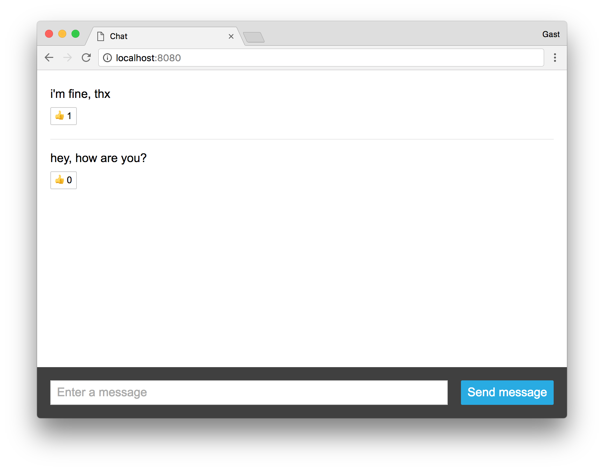
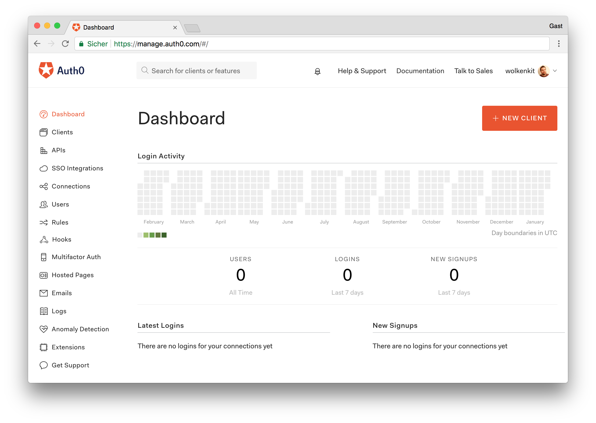
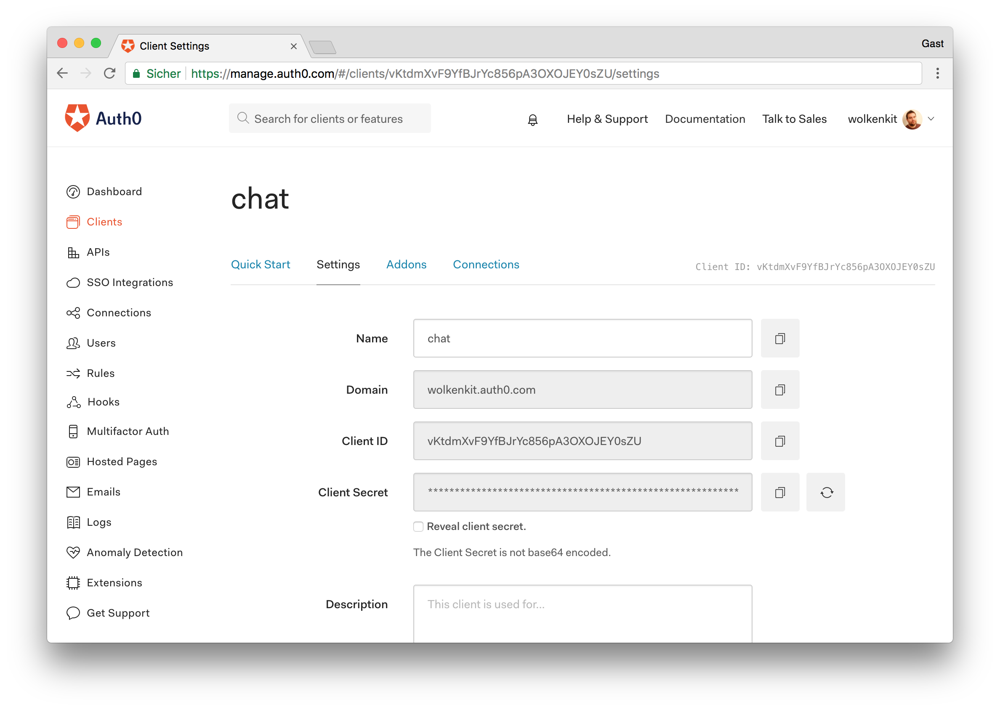
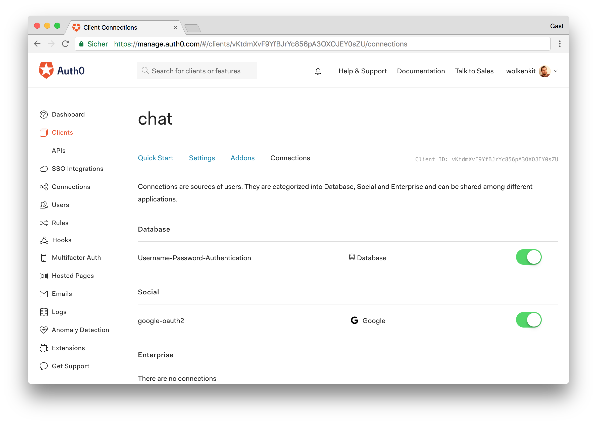
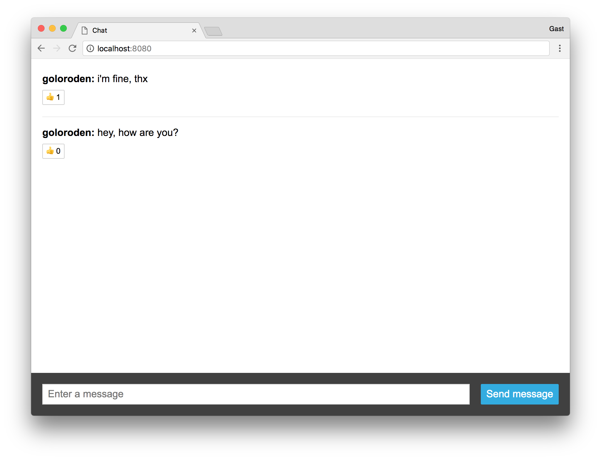

# Introduction

## Thinking about Security.

When thinking about security, you have to think about authentication and authorization with respect to three aspects, due to the CQRS and the event-based architecture:

* Who is allowed to **send commands**, such as `send` and `like`?
* Who is allowed to **receive events**, such as `sent` and `liked`?
* Who is allowed to **run queries**, such as listing any previously sent messages?

For the first iteration, we saw that it was sensible to allow everything to everyone, even to anonymous users. This made it easier to initially test and debug the application. 
This means that you were not able to add identity management for the first iteration. Instead, you will do this once the base of your application is up and running.

But now, we should have to functunality to only allow authenticated users to communicate.

IF you have followed along our previous guide, you would now be having a small chat Web-App (without authentication) which is able to send messages.



What is still missing is the handling of authentication and authorization of your users. To avoid having to worry about these things in every application, you can outsource this to a trusted third party, an **identity provider**. Its primary job is to identify your **users** and to issue **tokens** for them, similar to a passport.

Then, your **users need to send this token with every request**, so your backend can verify the validity of the token and identify the user based on the data stored in the token, or the **claims**. Since your application relies on an external service for handling identity, it becomes the **relying party**.

To avoid tampering with the tokens, they need to be **cryptographically signed**. Fortunately, there is a standard for issuing and handling these tokens. It is called _JWT (JSON Web Token) and uses a JSON-based format_ for implementing the tokens. The way how applications exchange these tokens is also described in a standard, called **OpenID Connect**.

Since your users send their tokens with every request, you do not need to use cookies and sessions anymore. Instead, this works perfectly well with stateless services, which is one of the main reasons why JWT and OpenID Connect gained a lot of popularity in the past few years.

This is where an **Identity Provider** comes into play, because these identity providers are **identity management as a service**, we can make use of _JWT_ and _OpenID Connect_ without the need to setup all the identity infrastructure by yourself.
You can use a variey of different Identity Providers such as ADFS, KeyCloak .etc
For the purpose of this article, we will be using the **Auth0** framework but bear in mind that any type of identity proving service can be implemented here, as long as it has all the features you need.

## Setting up Auth0

If you don't have an account yet, now is a good time to sign up for a free Auth0 account.

In your account, you need to create a new application first. For that, log in (or sign up) and go to the dashboard. Then, click the New Application button in the upper right corner to create a new application:



Now enter a name for the application, such as `chat`, and select **Single Page Web Applications** as the type. Confirming your input takes you to the quick start page of your newly created application. Open the _Settings_ tab:



Make a note of the following data, as you will need them later for configuring the application:

1. The client ID, e.g. `vKtdmXvF8YfBJrYc856pA3OXOIEY0sZO`.
2. The domain, e.g. `wolkenkit.auth0.com`.

Scroll down to Allowed Callback URLs and set it to `http://localhost:8080`. If the HTTP server of your client is running on a different port, adjust the URL as needed. Scroll down even further and click the Save Changes button.

Next, click _Show Advanced Settings_ (this is directly above the _Save Changes_ button). In the _OAuth_ tab, make sure that `RS256` is selected as signature algorithm. Disable the OIDC _Conformant_ setting, and save your changes.

Now, still in the _Advanced Settings_ section, open the _Certificates_ tab, click the _Download Certificate_ button to download the certificate in `.pem` format (the button is right above the _Save Changes_ button), and then **save the application**. With the client ID, the domain, and the certificate you have everything you need to setup authentication for your wolkenkit application.

However, before you can do this, you need to configure which strategies your users can use to authenticate themselves. Therefore, open the client's _Connections_ tab. By default, Auth0 uses a database to store your users' credentials. Also, the social `google-oauth2` strategy is enabled by default, which allows your users to authenticate using their Google account:



Next, click the _Connections_ section in the left navigation, and select _Database_ to configure the database strategy. Select the _Username-Password-Authentication_ entry to get to its settings. Enable the _Requires Username_ setting. This way you can make sure that your users always have a username.

## Configuring authentication in the backend

In order for the backend to be able to validate the tokens created using JWT, it must know the Auth0 certificate. Therefore, create a new directory to store the certificate there:

```bash
$ mkdir -p chat/server/keys/auth0
```


Copy the previously downloaded certificate into this directory and name the file `certificate.pem`.

You must also register the certificate in the file `package.json`. To do this, add the new section `identityProvider` to the `default` environment and enter the path to the certificate there. In this case, the root path is the directory in which the file `package.json` is located. You must also enter the address of your Auth0 account as the identity provider's name. Your `package.json` should now look like this:

```javascript
{
  "name": "chat",
  "version": "1.0.0",
  "wolkenkit": {
    "application": "chat",
    "runtime": {
      "version": "1.2.0"
    },
    "environments": {
      "default": {
        "api": {
          "address": {
            "host": "local.wolkenkit.io",
            "port": 3000
          },
          "allowAccessFrom": "*"
        },
        "identityProvider": {
          "name": "https://wolkenkit.auth0.com/",
          "certificate": "/server/keys/auth0"
        },
        "node": {
          "environment": "development"
        }
      }
    }
  }
}
```

Next, you must change the authorization for commands and events so that only authenticated users can send and receive them. Open the file `message.js` which contains the aggregate and replace the entries `forPublic` in the `isAuthorized` section with `forAuthenticated`:

```javascript
const initialState = {
  // ...

  isAuthorized: {
    commands: {
      send: { forAuthenticated: true },
      like: { forAuthenticated: true }
    },
    events: {
      sent: { forAuthenticated: true },
      liked: { forAuthenticated: true }
    }
  }
};
```

Omitting `forPublic` automatically sets these properties to false. If you want to be more explicit, you can keep them and set their values to `false` manually.

Since each message should now have an author, the aggregate's initial state, the `send` command, and the `sent` event must also be modified. The changes to the initial state are simple, as you only need to add an `author` field:

```javascript
const initialState = {
  author: undefined,
  text: undefined,
  likes: 0,

  isAuthorized: {
    // ...
  }
};
```

The changes to the `sent` event are also done easily. All you need to do is to set the `author` field to the value provided by the event:

```javascript
const events = {
  sent (message, event) {
    message.setState({
      author: event.data.author,
      text: event.data.text
    });
  },

  // ...
};
```

Next, you need to update the `send` command. It must take care of getting the name of the user who sent the command. To access the user and the token, there is the `user` property on the command object. So fetch the `nickname` from the token, and set its value as `author` for the `sent` event:

```javascript
const commands = {
  send (message, command, mark) {
    if (!command.data.text) {
      return mark.asRejected('Text is missing.');
    }

    message.events.publish('sent', {
      author: command.user.token.nickname,
      text: command.data.text
    });

    mark.asDone();
  },

  // ...
};
```

Of course, you need to update the `messages` list as well. Therefore, open the file `messages.js`, which contains the definition for the list, and add an `author` field here, too:

```javascript
const fields = {
  timestamp: { initialState: 0, fastLookup: true },
  author: { initialState: '' },
  text: { initialState: '' },
  likes: { initialState: 0 }
};
```

Additionally, you need to extend the handler function for the `sent` event, so that it takes the `author` field into account:

```javascript
const when = {
  'communication.message.sent' (messages, event, mark) {
    messages.add({
      author: event.data.author,
      text: event.data.text,
      timestamp: event.metadata.timestamp
    });
    mark.asDone();
  },

  // ...
};
```

Finally, you must restart the backend to make your changes effective. Any of the previously created data will be deleted. However, in this case, this is desirable, as the data model has changed:

```script
$ wolkenkit restart
```
## Updating the client

If you now try to access the backend with the client, this will no longer work because every request is rejected as unauthenticated. Therefore, the next step is to update the client. Fortunately, the changes are very small.

First of all, you need to extend the `render` function so that it also displays the name of the user who sent a message. Since the messages are loaded in the same way as before, all you have to do is add a new `<span>` element that displays the name:

```jsx
render (messages) {
  const html = messages.map(message =>
    `<li class="message">
      <div class="label">
        <span class="label-author">${message.author}:</span>
        ${message.text}
      </div>
      <div class="likes" data-message-id="${message.id}">
        <span class="button">👍</span>
        <span class="count">${message.likes || 0}</span>
      </div>
    </li>`
  ).join('');

  view.messages.innerHTML = html;
}
```

In the `index.js` file, you need to expand the connection setup so that OpenID Connect is configured as the authentication strategy. There you will need to set the `/authorize` endpoint of your account, **specify the client ID**, and make some other settings:

```jsx
wolkenkit.connect({
  host: 'local.wolkenkit.io',
  port: 3000,
  authentication: new wolkenkit.authentication.OpenIdConnect({
    identityProviderUrl: 'https://wolkenkit.auth0.com/authorize',
    clientId: 'vKtdmXvF8YfBJrYc856pA3OXOIEY0sZO',
    scope: 'profile',
    strictMode: false
  })
}).
  then(chat => {
    // ...
  }).
  catch(err => {
    // ...
  });
  ```
  
Once the connection has been established, you must now check whether the user is already logged in. If not, call the `login` function:

```jsx
wolkenkit.connect({
  // ...
}).
  then(chat => {
    if (!chat.auth.isLoggedIn()) {
      return chat.auth.login();
    }

    // ...
  }).
  catch(err => {
    // ...
  });
  ```
  
That's it. Now the wolkenkit client SDK knows that it should use OpenID Connect for authenticating users. When you call the `login` function you are redirected to Auth0, where your users can register or log in – either using the Auth0 database or using their Google account.

Once you have reloaded the client in your browser and logged in, you can now use the chat as before, but this time with authentication:


