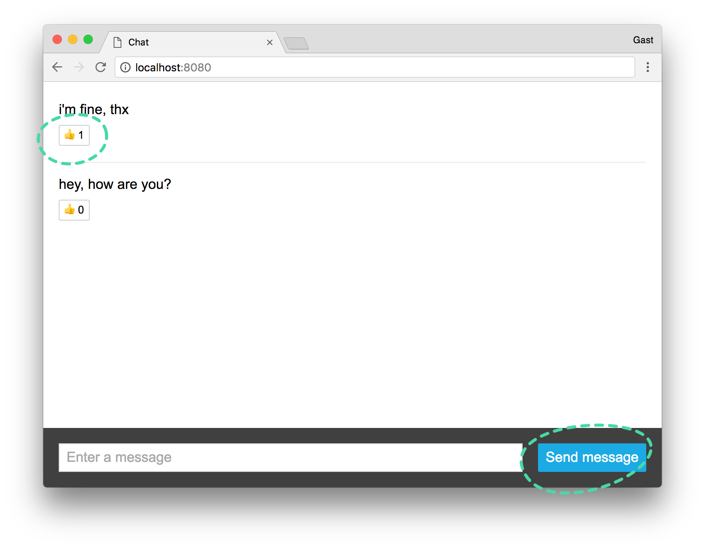
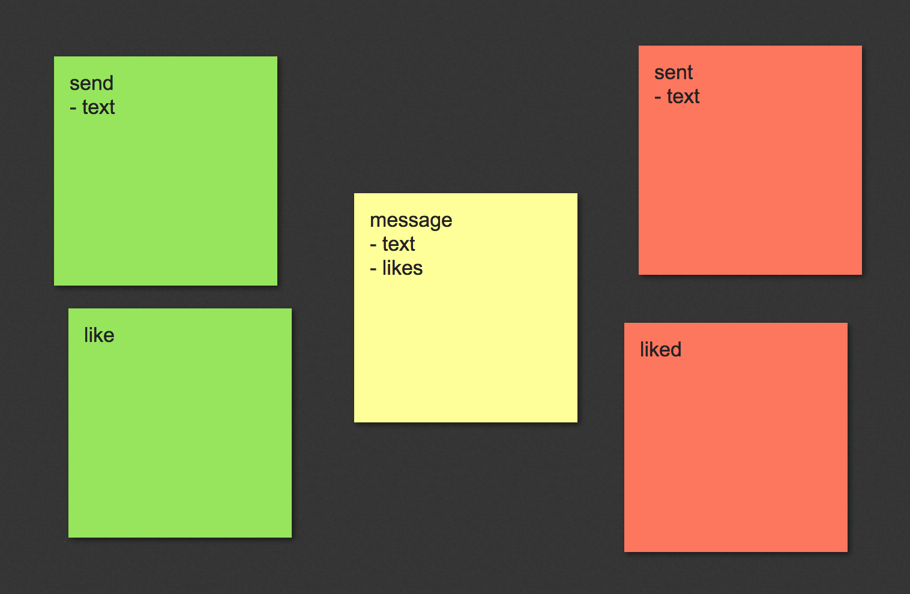
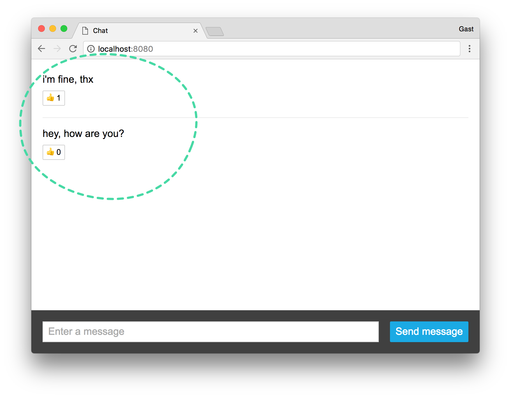

# Modeling with your team

You are probably tempted to start thinking about the technical parts of the application, such as encrypting messages, having an API, and so on.

Anyway, this is not the application's core domain. You don't create the application because you want to do encryption or build an API. You create the application because you want to enable people to talk to each other by sending and receiving messages. So, for now, let's focus on the actual domain.

:::hint-tip
> **Take your time to discuss**
>
> Although you probably read this guide alone, in reality software development is a team process. This means that you will discuss a lot about finding the right words and what their meanings are. Having these discussions right from the start makes a huge difference for the entire team. Take your time to discuss, play with variations, and do not stop before you have reached consensus.
:::

## Carve out commands

When modeling an application, the first thing to do is to identify the user actions that update the application state. For that have a look at the following image.

As you can see, there are a text box with a *Send message* button, and below each message a button to like it. In wolkenkit, actions like these are called **commands**.

When the user wants to run a command, the application decides whether this is allowed. There may be various reasons why an application rejects a command, e.g. there may be the constraint that a given user can only send a limited number of messages within a specific range of time, or a message must not be empty.

Since a command is an instruction to the application, it is phrased using the imperative. Hence we choose *send message* and *like message*.

:::hint-tip
> **Different words have different meanings**
>
> It may be obvious to name the commands *send message* and *like message*, but there would have been alternatives. E.g., instead of *like* you might also have used *react*, *up-vote*, or *mark*. Each of these words comes with a different meaning, and you have to look for the word that best matches the intention of your core domain.
:::

Maybe you have come up with something that uses words such as *create* and *update*. Keep in mind that this usually is not the language of your users to describe their needs. Developers often tend to use technical terminology such as *create*, *read*, *update*, and *delete*. Avoid these words when discussing the domain language, as these words are very generic and do not carry much semantics. What you get from this is a better understanding of your core domain.

:::hint-warning
> **Commands will write**
>
> As commands are only about writing to the application, i.e. updating its state, there is no *receive message* command. Receiving messages means reading from the application, which does not change its state. We will take care of this later.
:::

## Carve out events

When the application allows the command to update the application state, it publishes an **event**. An event describes a fact that has happened and can not be undone. Hence they are phrased using past tense.

This way we come up with two events, *sent message* and *liked message*.

These events are what is actually stored in the event store, and what can be replayed eventually. The more specific your events are, the better you can reinterpret them when needed.

## Aggregating commands and events

When the user runs a command, there must be something that handles it and decides whether it is allowed to update the application state. For that, you need an **aggregate** that embraces commands and events, and that contains the state it needs to make decisions.

In our simple example there are now two options. You could model the entire chat as a single aggregate, or have an aggregate that represents a message. We decide to use an aggregate named *message*, since there are no domain constraints regarding the chat itself. Additionally, every message needs its individual state, e.g. to store the number of likes it has received.

Since the aggregate is now called *message*, there is no need to repeat the aggregate's name inside of every command and event. So, *send message*, *like message*, *sent message*, and *liked message* simply become *send*, *like*, *sent*, and *liked*. Now, your whiteboard might look similar to this:

## Defining the context

In more complex applications you will have multiple aggregates. While some of them will be closely related to each other, others will address completely different parts of your application. To group related aggregates use a **context**. Although currently we only have a single aggregate, we need to define a context. Let's call it *communication*.

That's it for the write model.

## Defining lists

If you now have another look at the image below, you will realize that the list of messages is still missing, which is another important part of the application:

In contrast to aggregates, commands, and events, reading a list does not update the application state. Hence defining a list does not belong to the write model, but to the read model.

So, we define a list called *messages* with the following structure:

| id | timestamp     | text              | likes |
|----|---------------|-------------------|-------|
| …  | 1484145874599 | hey, how are you? |     0 |
| …  | 1484145883548 | i'm fine, thx     |     1 |

Now, let's start to code by [creating the write model](../creating-the-write-model/)!
